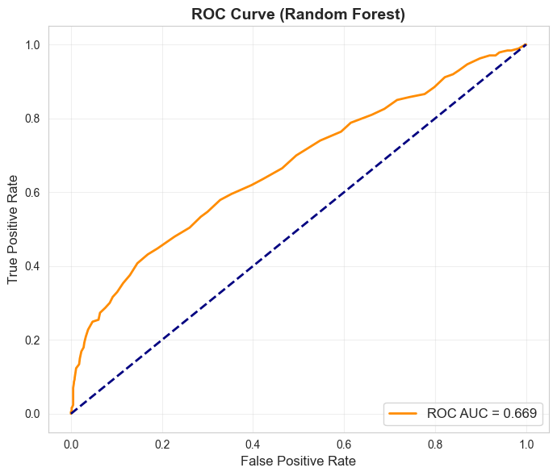
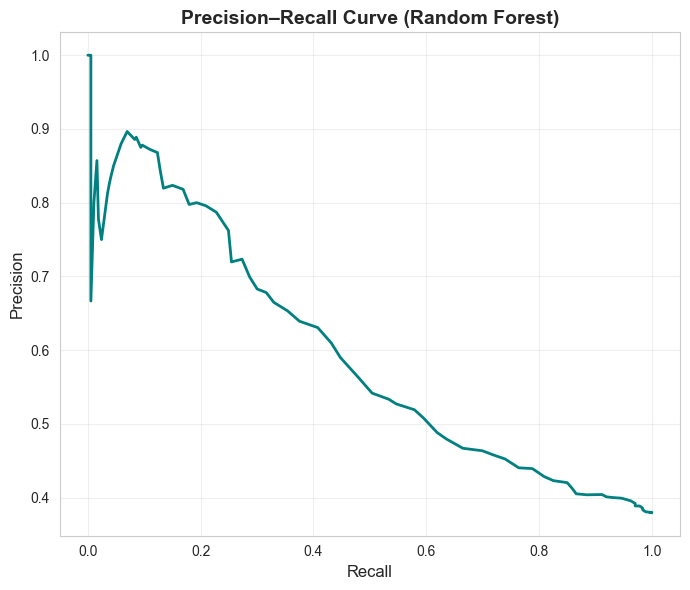

# Drinking Water Potability Prediction using ML and H2O AutoML

This project explores how machine learning can be applied to assess water quality and predict whether drinking water is potable based on its chemical characteristics. Access to clean water is a fundamental human right, and this project aims to show how data-driven approaches can support public health and environmental monitoring.

This project combines classical ML models with **H2O AutoML** to evaluate how automated machine learning can assist in practical, real-world challenges.

---

## Dataset  

The dataset used is `drinking_water_potability.csv`, which contains **3,276 samples** of water bodies.  
Each sample includes several chemical properties, such as:

- pH  
- Hardness  
- Solids  
- Chloramines  
- Sulfate  
- Conductivity  
- Organic carbon  
- Trihalomethanes  
- Turbidity  

The target variable (`Potability`) indicates whether the water is **safe to drink (1)** or **not safe (0)**.  

---

## Steps Taken  

1. **Importing Libraries and Dataset**  
  - Imported Python libraries for data handling, visualization, and machine learning, including:  
  `numpy`, `pandas`, `matplotlib`, `seaborn`, `sklearn` modules (`train_test_split`, `ExtraTreesClassifier`, `StandardScaler`, `LogisticRegression`, `SVC`, `RandomForestClassifier`, `accuracy_score`, `confusion_matrix`, `classification_report`, `roc_auc_score`, `roc_curve`, `precision_recall_curve`), and `h2o` with `H2OAutoML`.
 
   - Loaded the dataset and inspected its shape, structure, and missing values  

2. **Data Analysis and Preprocessing**  
   - Checked data distributions and correlations  
   - Handled missing values and potential outliers  

3. **Feature Engineering**  
   - Normalized variables where necessary  
   - Considered relationships between chemical attributes  

4. **Model Building with Random Forest**  
   - Trained a Random Forest model on the processed dataset  
   - Evaluated results using **ROC AUC** and classification metrics  

5. **Model Building with H2O AutoML**  
   - Initialized H2O AutoML  
   - Automatically trained multiple algorithms and compared results  

6. **Model Evaluation and Visualization**  
   - Plotted the **ROC Curve** to evaluate discrimination power  
   - Plotted the **Precision–Recall Curve** to analyze trade-off in imbalanced data  

---

## Results  

- **Random Forest ROC AUC: 0.669** → Above random guessing, but with room for improvement  

- **ROC Curve**: Showed moderate discriminative ability  
  

- **Precision–Recall Curve**: Highlighted the trade-off between precision and recall, especially given class imbalance  
  )  


---

## Key Observations  

- H2O AutoML provided a strong baseline without extensive manual tuning.  
- Imbalance in the dataset impacted recall, suggesting the need for **SMOTE, class weights, or threshold tuning**.  
- Further improvements could be achieved through hyperparameter optimization and feature engineering guided by water domain expertise.  

---

## Technologies Used  

- Python 3.10  
- pandas, numpy  
- seaborn, matplotlib  
- scikit-learn (LogisticRegression, SVM, RandomForest, ExtraTrees, metrics, preprocessing, model_selection)  
- H2O AutoML  

---

## How to Run  

1. Clone the repository and make sure the dataset file `drinking_water_potability.csv` is in the same folder.  
2. Install the required libraries:  

   ```bash
   pip install pandas numpy seaborn matplotlib scikit-learn h2o
    ```

3. Open the Jupyter notebook (`Drinking_Water_Potability.ipynb`).  
4. Run the cells from top to bottom to reproduce the full analysis, visualizations, and model comparisons.  

---

## Files Included  

- `Drinking_Water_Potability.ipynb` – Main notebook with full pipeline  
- `drinking_water_potability.csv` – Dataset used  
- `README.md` – Documentation and project overview  
- `requirements.txt` – Python dependencies  

---

## Conclusion  

This project demonstrates the use of machine learning and AutoML in predicting water potability. While the baseline results are promising, further improvements can make this approach more reliable for **real-world water quality assessment** and public health applications.

---

> Developed by Amirhosein Ashrafian — Published in September 2025  
